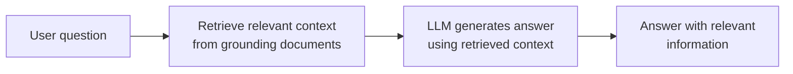
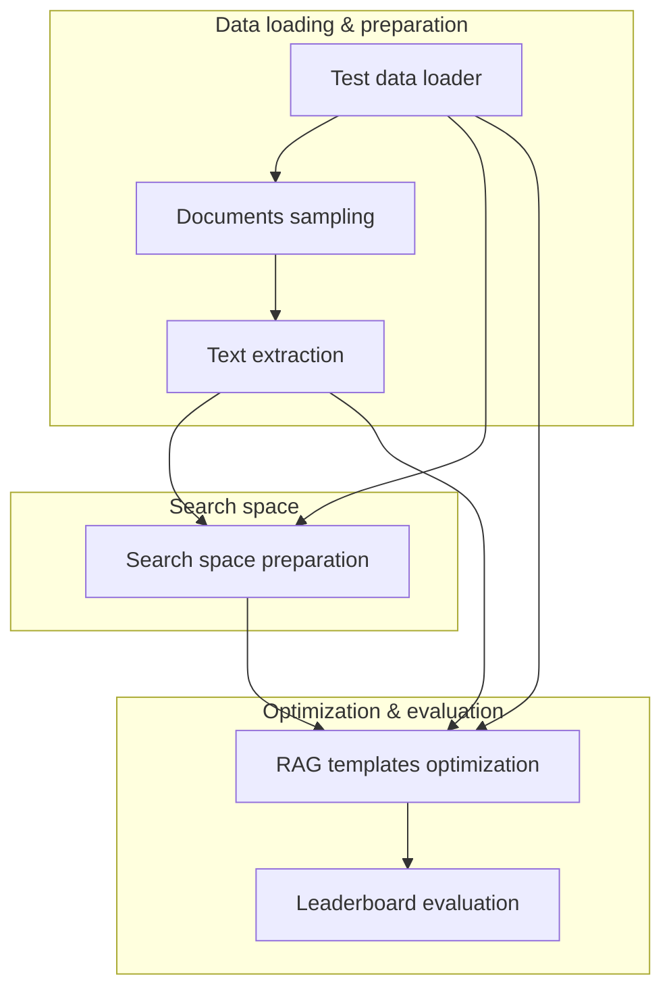
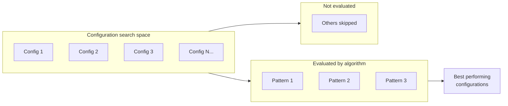

# AutoRAG (Developer Preview)

**AutoRAG** on Red Hat OpenShift AI lets you run and evaluate **Retrieval-Augmented Generation (RAG)** over your documents from a **notebook** in the workbench. You provide documents and test questions; the notebook drives execution (using [IBM ai4rag](https://github.com/IBM/ai4rag)-style workflows) against a **Llama-stack RAG server** and lets you explore answers, retrieval, and metrics directly in the notebook. See [Example scenarios](#example-scenarios) for a typical use case and a step-by-step tutorial.

**Status:** [Developer Preview](https://access.redhat.com/support/offerings/devpreview) — This feature is not yet supported with Red Hat production service level agreements (SLAs) and may change. It provides early access for testing and feedback.

---

## Table of contents

- [About AutoRAG](#about-autorag)
  - [What AutoRAG gives you](#what-autorag-gives-you)
  - [What AutoRAG supports (Developer Preview)](#what-autorag-supports-developer-preview)
  - [How it works under the hood](#how-it-works-under-the-hood)
  - [Sample notebook and experiment flow (ai4rag)](#sample-notebook-and-experiment-flow-ai4rag)
- [What you need to provide](#what-you-need-to-provide)
  - [Required](#required)
  - [Optional](#optional)
- [What you get from a run](#what-you-get-from-a-run)
- [Example scenarios](#example-scenarios)
- [Prerequisites](#prerequisites)
- [Running AutoRAG](#running-autorag)
- [📚 Tutorial: Ask questions against 2025 IBM financial reports](financial_reports_tutorial.md)
- [References](#references)

---

## About AutoRAG

### What AutoRAG gives you

AutoRAG in this preview is **notebook-driven**: you run a notebook in an OpenShift AI workbench that executes RAG against your documents and a prepared RAG stack.

- **Document-based Q&A** — Your documents (e.g., PDFs or text) are stored in S3. The notebook uses them as the knowledge base for retrieval-augmented question answering.
- **Test data** — A `test_data.json` file (also in S3) defines the questions (and optionally expected answers) used to run and evaluate RAG.
- **RAG stack** — A **Llama-stack server** with the RAG stack (chat model, embedding model, vector store such as Milvus) is a prerequisite. See [Llama stack setup](../../llamastack/SETUP.md) for installation. The notebook sends requests to this stack for embedding, retrieval, and generation.
- **Results in the notebook** — You run the notebook cell-by-cell, then explore answers, retrieved chunks, and evaluation results directly in the notebook (no separate pipeline UI).

You do not need to deploy the RAG application yourself for this flow; the notebook orchestrates runs against the existing RAG stack and lets you inspect outcomes.

### What AutoRAG supports (Developer Preview)

In this preview, AutoRAG is exposed as a **workbench notebook** that uses IBM ai4rag-style execution against Red Hat OpenShift AI’s Llama-stack RAG infrastructure.

| Area | Support |
|------|--------|
| **Documents** | Stored in S3-compatible object storage (via RHOAI Connections); e.g. PDF or text (IBM financial reports). |
| **Test data** | JSON file in S3 (e.g. `benchmark.json` or `test_data.json`): list of items with `question`, `correct_answers`, and `correct_answer_document_ids` for evaluation. |
| **RAG stack** | Llama-stack server with RAG stack (chat model, embedding model, vector store e.g. Milvus). See [Llama stack setup](../../llamastack/SETUP.md). |
| **Execution** | Notebook in OpenShift AI workbench (ai4rag-style runs). |
| **What you get** | Answers, retrieved context, and evaluation results explored in the notebook. |

**Not in scope (this preview):** Fully automated RAG pipeline runs (e.g. via Kubeflow Pipelines).

### How it works under the hood

The notebook runs in your **workbench** and uses **RHOAI Connections** to read documents and test data from S3. It calls the **Llama-stack RAG server** (deployed as a prerequisite in your project; see [Llama stack setup](../../llamastack/SETUP.md)) for embeddings, retrieval, and LLM responses. The flow follows patterns: ingest documents, run queries from test data, and evaluate results.

**RAG interaction pattern** — User question → retrieve context from grounding documents → LLM generates answer with that context.

**2. Documents RAG optimization pipeline** — Kubeflow pipeline steps from the [documents RAG optimization pipeline](https://github.com/LukaszCmielowski/pipelines-components/tree/rhoai_autorag/pipelines/training/autorag/documents_rag_optimization_pipeline): load test data and input documents, sample and extract text, prepare the search space, run RAG templates optimization (HPO), then evaluate patterns on a leaderboard.

**RAG configuration optimization** — The optimizer chooses which subset of the configuration search space to evaluate (e.g. 16 candidate patterns); it ranks evaluated patterns and tags the top performers (e.g. top 3) as best, and skips the rest to avoid full grid search.

### Sample notebook and experiment flow (ai4rag)

The scenario is based on the [IBM ai4rag](https://github.com/IBM/ai4rag) sample notebook and experiment script. In that pattern:

1. **Connect to the RAG stack** — The notebook uses a client (e.g. `LlamaStackClient`) configured with the **Llama-stack base URL** (the RAG server endpoint). You set this URL in the notebook so it targets your deployed Llama-stack RAG server (deploy it first using [Llama stack setup](../../llamastack/SETUP.md)).
2. **Load documents** — Documents are loaded from a path (e.g. via `FileStore` or from an S3-mounted/local path). In the workbench, you point this path to where your S3 connection exposes the documents (e.g. after syncing or mounting the bucket).
3. **Load benchmark/test data** — The notebook loads the question set from a JSON file (e.g. `read_benchmark_from_json` for `test_data.json` or `benchmark_data.json`). The JSON contains the questions and optionally expected answers or references for evaluation.
4. **Configure search space** — You can define a search space (e.g. foundation model, embedding model, retrieval method) and optional optimizer settings (e.g. number of evaluations). The sample uses `AI4RAGSearchSpace` and `GAMOptSettings`; the notebook may use defaults or allow you to tune these.
5. **Run the experiment** — The notebook runs an **AI4RAG experiment** (e.g. `AI4RAGExperiment`) against the Llama-stack, typically with a vector store type such as `ls_milvus`. It runs the search/optimization and writes results to an output path.
6. **Explore results** — You get a **best configuration** (e.g. best model/embedding/retrieval combination) and can explore answers, retrieved chunks, and evaluation metrics in the notebook. Results may also be written to a local or S3 output directory.

For the exact cells and code, see the [run_ai4rag.ipynb](https://github.com/IBM/ai4rag/blob/dev-samples/samples/run_ai4rag.ipynb) notebook and [run_experiment.py](https://github.com/IBM/ai4rag/blob/dev-samples/dev_utils/run_experiment.py) script in the ai4rag repository (`dev-samples` branch).

---

## What you need to provide

To run the AutoRAG notebook, you provide:

### Required

| Item | Description |
|------|-------------|
| **Documents** | Your source documents (e.g. IBM 2025 quarterly financial reports, one file per quarter) uploaded to an S3-compatible bucket. You can download quarterly earnings presentations (PDFs) from [IBM Financial Reporting](https://www.ibm.com/investor/financial-reporting) (select year 2025 and Q1–Q4). The notebook or RAG stack ingests them for retrieval. |
| **Test data** | A benchmark JSON file in S3 (e.g. `benchmark.json` or `test_data.json`). Format: a list of objects with `question`, `correct_answers` (list of strings), and `correct_answer_document_ids` (list of document IDs that should contain the answer). Document metadata in the extracted corpus must include `document_id` matching these IDs. |
| **S3 connections** | RHOAI Connections so the workbench can read from the bucket(s) where documents and `test_data.json` are stored. |
| **RAG stack** | A Llama-stack server with the RAG stack enabled (chat model, embedding model, vector store such as Milvus), deployed in the project or accessible from the workbench. See [Llama stack setup](../../llamastack/SETUP.md) for installation. You will need the **RAG stack base URL** (e.g. for `LlamaStackClient` in the notebook) so the notebook can call the server. |

### Optional

| Item | Description |
|------|-------------|
| **Notebook config** | Bucket name and object keys for documents and benchmark JSON; environment variables `AWS_ACCESS_KEY_ID`, `AWS_SECRET_ACCESS_KEY`, `AWS_S3_ENDPOINT`, `LLAMA_STACK_CLIENT_BASE_URL`, `LLAMA_STACK_CLIENT_API_KEY`. Optimizer settings (e.g. `max_evals`, `n_random_nodes`) and search space (foundation model, embedding model). |

---

## What you get from a run

When you run the AutoRAG notebook:

- **Best configuration** — If the notebook runs an ai4rag experiment with search/optimization (e.g. GAMOpt), you get a **best configuration** (e.g. best foundation model, embedding model, and retrieval method combination) printed or displayed in the notebook.
- **Answers** — Model-generated answers for each question in `test_data.json` (benchmark data), visible in the notebook.
- **Retrieved context** — The chunks/documents retrieved for each query, so you can inspect what the RAG stack used.
- **Evaluation results** — Metrics or comparisons (e.g. against expected answers, if provided in test data) that you can explore in the notebook.
- **Output path** — The sample experiment script writes results to an output path (e.g. a local or S3 directory); the notebook may display or link to these artifacts.

All outcomes are explored **inside the notebook** (tables, markdown, or plots as defined by the notebook).

---

## Example scenarios

AutoRAG in this preview is aimed at **document Q&A and evaluation**: you have a set of documents (e.g. reports, manuals) and a list of questions; you run the notebook to get answers and inspect retrieval and quality.

| Scenario | Your data | What you do | Outcome |
|----------|-----------|-------------|---------|
| **Financial reports Q&A** | IBM 2025 quarterly financial reports (PDF/text) in S3—download from [IBM Financial Reporting](https://www.ibm.com/investor/financial-reporting); `test_data.json` with questions | Run the notebook against the Llama-stack RAG server | Answers and retrieved snippets in the notebook; evaluate consistency and relevance. |
| **Internal docs Q&A** | Policy or product docs in S3; test questions in JSON | Same flow | Inspect answers and retrieval for each question in the notebook. |
| **Evaluation run** | Documents + test set with expected answers | Run notebook | Compare model answers to references and review metrics in the notebook. |

To try this yourself, follow the [📚 Tutorial: Ask questions against 2025 IBM financial reports](financial_reports_tutorial.md): download the reports from [IBM Financial Reporting](https://www.ibm.com/investor/financial-reporting), upload IBM 2025 quarterly reports and `test_data.json` to S3, ensure the [Llama stack is set up](../../llamastack/SETUP.md) and the RAG stack is ready, run the notebook, and explore the results.

---

## Prerequisites

- **Llama stack** set up — See [Llama stack setup](../../llamastack/SETUP.md) for installation and configuration.
- **Red Hat OpenShift AI** installed and accessible.
- A **data science project** and a **workbench** (notebook environment) where you will run the AutoRAG notebook.
- **Llama-stack server with RAG stack** — Deploy and configure a Llama-stack server in the project with the RAG stack (chat model, embedding model, and vector store such as Milvus). Follow [Llama stack setup](../../llamastack/SETUP.md) for installation and configuration. The notebook will use this server for retrieval and generation. See also [Deploying a RAG stack in a project](https://docs.redhat.com/en/documentation/red_hat_openshift_ai_self-managed/3.0/html/working_with_llama_stack/deploying-a-rag-stack-in-a-project_rag) and [Build AI/Agentic Applications with Llama Stack](https://docs.redhat.com/en/documentation/red_hat_openshift_ai_self-managed/3.2/html-single/working_with_llama_stack/working_with_llama_stack).
- **S3 connection(s)** (RHOAI Connections) for:
  - The bucket containing your **documents** (e.g. IBM 2025 quarterly financial reports).
  - The bucket (or same bucket) containing **test_data.json**.
- Attach the S3 connection(s) to your workbench so the notebook can read documents and test data.

---

## Running AutoRAG

You run AutoRAG by **running the notebook** in your workbench:

1. Ensure the **Llama-stack RAG stack** is deployed (see [Llama stack setup](../../llamastack/SETUP.md)) and that the notebook is configured to use it (e.g. endpoint, API key if required).
2. Ensure **documents** and **test_data.json** are uploaded to S3 and that the workbench has an S3 connection to those locations.
3. Open the AutoRAG notebook in the workbench, set any required paths (bucket names, object keys for documents and `test_data.json`) if needed.
4. Run the notebook cells in order. The notebook will drive ai4rag-style execution: load/ingest documents (or use existing vector store), run questions from `test_data.json`, call the RAG stack, and display answers and retrieval results.
5. **Explore the results** in the notebook: answers, retrieved chunks, and any evaluation metrics or plots.

There is no separate “AutoRAG pipeline run” in this preview; execution is entirely notebook-driven.

---

## 📚 Tutorial: Ask questions against 2025 IBM financial reports

**Scenario:** You have **IBM financial reports from 2025** (one document per quarter) and a **test_data.json** file with questions about them. The goal is to run a RAG workflow from a notebook in OpenShift AI (using ai4rag-style execution) against a **Llama-stack RAG server**, then explore answers and retrieval results in the notebook.

**Step-by-step guide:** The full tutorial walks you through creating a project and workbench, deploying the Llama-stack server with the RAG stack, creating an S3 connection and uploading documents, attaching the S3 connection to the workbench, opening and configuring the AutoRAG notebook, and running the notebook to explore results. Follow the tutorial here: **[Financial reports tutorial](financial_reports_tutorial.md)**.

---

## References

- [Llama stack setup](../../llamastack/SETUP.md) — Installation and configuration for the Llama-stack RAG server (prerequisite for AutoRAG)
- [IBM ai4rag](https://github.com/IBM/ai4rag) — RAG templates and optimization patterns
- [run_ai4rag.ipynb (ai4rag samples, dev-samples branch)](https://github.com/IBM/ai4rag/blob/dev-samples/samples/run_ai4rag.ipynb) — Sample notebook: Setup, Prepare experiment data, Process input documents (test data loader, documents sampling, Docling text extraction), Run ai4rag experiment, Review results
- [pipelines-components (rhoai_autorag_data_processing_pipeline)](https://github.com/LukaszCmielowski/pipelines-components/tree/rhoai_autorag_data_processing_pipeline) — KFP components used in the notebook: test_data_loader, documents_sampling, text_extraction
- [run_experiment.py (ai4rag dev_utils, dev-samples branch)](https://github.com/IBM/ai4rag/blob/dev-samples/dev_utils/run_experiment.py) — Sample experiment script (LlamaStackClient, AI4RAGExperiment, GAMOpt, ls_milvus)
- [Deploying a RAG stack in a project (Red Hat OpenShift AI)](https://docs.redhat.com/en/documentation/red_hat_openshift_ai_self-managed/3.0/html/working_with_llama_stack/deploying-a-rag-stack-in-a-project_rag)
- [Build AI/Agentic Applications with Llama Stack (Red Hat OpenShift AI)](https://docs.redhat.com/en/documentation/red_hat_openshift_ai_self-managed/3.2/html-single/working_with_llama_stack/working_with_llama_stack)
- [Using connections (Red Hat OpenShift AI)](https://docs.redhat.com/en/documentation/red_hat_openshift_ai_self-managed/2.22/html/working_on_data_science_projects/using-connections_projects)
